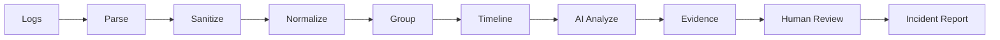

# AIログ解析・障害原因分析ツール

## Overview

アプリケーションログ、エラーログ、JSON Log、Stack Traceをブラウザ内でParse・Sanitize・Normalize・Groupし、根拠ログまで辿れる原因候補を提示する障害解析支援Webアプリです。

単にログ全文をLLMへ渡すのではなく、件数・頻度・時系列・グループを通常コードで確定した後、AIには解釈だけを担当させます。AIが使えない場合も、Log Viewer、Timeline、Error Groups、ローカル原因候補は利用できます。

## Problem

大量ログをそのまま生成AIへ貼り付ける方法には、機密情報流出、重複ログによるToken浪費、根拠のない断定、存在しない行番号の引用、件数の誤計算という問題があります。本アプリは解析前処理とHuman Reviewを製品体験の中心に置きます。

## Features

- Pasteおよび複数ファイル入力（`.log` / `.txt` / `.json`、各5MBまで）
- Plain Text、Timestamp Log、行単位JSON、複数行Stack TraceのParse
- ERROR / WARN / INFO / DEBUG認識
- Health Check、Polling、冗長DEBUGのNoise折り畳み
- Secret / PII Masking Preview
- UUID、Request ID、User ID、Port、Memory Address、長い数値の正規化
- Error Grouping、Frequency、First/Last Seen
- 複数Sourceを統合したTimeline
- 検索、Level・Source・Error Group Filter
- 構造化AI解析とCitation Validation
- EvidenceからOriginal Logへのジャンプ
- 原因候補・対応案へのHuman Review StatusとNote
- Incident Report（Markdown）と障害共有用SummaryのCopy
- Virtualized Log Viewer
- Desktop Split View、Tablet、Mobile Tab UI

## Demo

登録不要で次の架空障害を試せます。

1. Database Timeout：接続プール逼迫、Timeout、注文API 500、Retry Queue
2. Frontend JavaScript Error：欠損APIレスポンス、TypeError、Stack Trace
3. External API Rate Limit：HTTP 429、Backoff、Queue増加、Retry Budget枯渇

Demoには正常Request、Health Check、INFO、DEBUGなどのNoiseと、マスキング確認用の完全に架空のSecret文字列を含めています。

## Log Analysis Workflow



Parse、Sanitize、Normalize、Group、Timeline、件数計算はブラウザ内で実行します。LLMへ送信されるのはSanitized Copyと決定論的に算出した事実だけです。

## Secret Masking

次のパターンを通常コードで検出し、AI送信用コピーだけを置換します。

- Bearer Token / Authorization Header
- JWT
- API Key
- Password
- Cookie
- Email Address
- IPv4 Address
- Credit Cardらしき13〜19桁
- PostgreSQL / MySQL / MongoDB / Redis Connection String

Original Logは変更・永続保存しません。正規表現ベースのため、誤検出・未検出の可能性があります。

## Error Grouping

ERRORとWARNのメッセージから動的値を正規化し、Levelと正規化済みPatternをFNV-1a HashでGroupingします。元ログとLine IDは保持されます。

正規化対象：

- UUID
- Timestamp
- Request / Trace / User ID
- Port
- Memory Address
- 長い数値

意味的類似度ではなく決定論的な文字列Pattern Groupingです。

## AI Root Cause Analysis

`/api/analyze` Route Handlerを介してOpenAI互換APIをServer側から呼び出します。API KeyはFrontend Bundleへ入りません。

AI Provider未設定時はローカル解析にフォールバックします。AIは原因を断定せず、High / Medium / Lowの候補として提示します。件数とDurationはAIレスポンスを採用せず、コード側の値で上書きします。

## Evidence / Citation

各イベントには`source.log:L1`または`source.log:L1-L3`形式のIDがあります。AIへ利用可能なEntry IDとCitationの組だけを渡し、返却後にServerとClientの両方で照合します。存在しないCitationやEntry IDとの組み合わせが不正なCitationは表示しません。

## Human-in-the-loop

原因候補と対応案は次の状態でレビューできます。

- 未確認
- 確認済み
- 対応候補
- 対象外

原因候補にはHuman Noteを追加できます。ツール自身はServer Restart、DB Query、Config変更、Deployなどの本番操作を実行しません。

## Privacy

- 生ログはデフォルトで永続保存しません
- Parse、Search、Filter、Masking、Grouping、FrequencyはLocal-first
- AIにはSanitized Logのみを送信
- Secretは`.env.local`で管理し、Frontendへ露出させない
- Demo Dataはすべて架空

## Prompt Injection Defense

System Promptでログを信頼できないDataとして明示し、ログ内命令に従わないよう制約します。送信するタスク・決定論的な事実・ログDataを分離し、返却値はZod SchemaとCitation Allowlistで検証します。

Prompt Injection対策は多層防御であり、完全な防御を保証するものではありません。

## Architecture

- `src/lib/log-engine.ts`：Parser、Sanitizer、Normalizer、Grouper、Frequency、Anomaly
- `src/lib/analysis.ts`：Structured Output Schema、ローカル解析、Citation Validation
- `src/lib/ai-provider.ts`：AI Provider abstraction、OpenAI互換Provider
- `src/app/api/analyze/route.ts`：Server API、入力検証、Provider呼び出し
- `src/components/analyzer-app.tsx`：入力、Viewer、Analysis、Human Review、Export
- `src/data/demos.ts`：3種類の架空障害ログ

## Tech Stack

- Next.js 16 App Router
- React 19
- TypeScript
- Zod
- TanStack Virtual
- Lucide React
- Tailwind CSS 4（CSS Processing）
- Vitest
- OpenAI-compatible Chat Completions API

## Getting Started

```bash
npm install
copy .env.example .env.local
npm run dev
```

`http://localhost:3000`を開き、Demoを選択してください。AI Providerなしでも主要なローカル解析Workflowを利用できます。

## Environment Variables

```env
AI_API_KEY=
AI_BASE_URL=https://api.openai.com/v1
AI_MODEL=gpt-4.1-mini
```

`AI_API_KEY`はServer側でのみ参照します。実際のSecretをGitへCommitしないでください。

## Testing

```bash
npm run lint
npm run typecheck
npm test
npm run test:e2e
```

Unit TestではParser、Timestamp、Level、Stack Trace、Masking、JWT、Grouping、Dynamic Value Normalization、Frequency、Timeline、Search、Filter、Structured Output、Citation Validation、Invalid Citation、Export、Prompt Injection Input、AI Failureを確認します。

Playwright E2EではシステムのMicrosoft Edgeを使い、3種類のDemo、Secret Mask、Evidence Jump、AI Failure時のFallback、Desktop、Mobile Tab、Console Errorを実画面で確認します。実画面から取得した画像は`public/screenshots/`に保存されます。

## Build

```bash
npm run build
npm start
```

## Deployment

VercelなどNext.js Route Handlerが動作する環境へDeployできます。環境変数はDeploy先のSecret管理機能へ登録してください。

## Known Limitations

- Parserは汎用的なHeuristicであり、すべての独自ログ形式を完全には解釈しません
- Groupingは文字列Patternベースで、意味的に似ている別文面までは統合しません
- Maskingは正規表現ベースで、すべてのSecret / PII検出を保証しません
- Time Rangeの手動スライダーとPDF Exportは未実装です
- Human Review内容はブラウザを閉じると失われます
- AI連携はOpenAI互換Chat Completions APIを前提とします
- 公開URL：https://ai-log-root-cause-analyzer.vercel.app
- GitHub URLは未設定です

## Getting Started

First, run the development server:

```bash
npm run dev
# or
yarn dev
# or
pnpm dev
# or
bun dev
```

Open [http://localhost:3000](http://localhost:3000) with your browser to see the result.

You can start editing the page by modifying `app/page.tsx`. The page auto-updates as you edit the file.

This project uses [`next/font`](https://nextjs.org/docs/app/building-your-application/optimizing/fonts) to automatically optimize and load [Geist](https://vercel.com/font), a new font family for Vercel.

## Learn More

To learn more about Next.js, take a look at the following resources:

- [Next.js Documentation](https://nextjs.org/docs) - learn about Next.js features and API.
- [Learn Next.js](https://nextjs.org/learn) - an interactive Next.js tutorial.

You can check out [the Next.js GitHub repository](https://github.com/vercel/next.js) - your feedback and contributions are welcome!

## Deploy on Vercel

The easiest way to deploy your Next.js app is to use the [Vercel Platform](https://vercel.com/new?utm_medium=default-template&filter=next.js&utm_source=create-next-app&utm_campaign=create-next-app-readme) from the creators of Next.js.

Check out our [Next.js deployment documentation](https://nextjs.org/docs/app/building-your-application/deploying) for more details.
